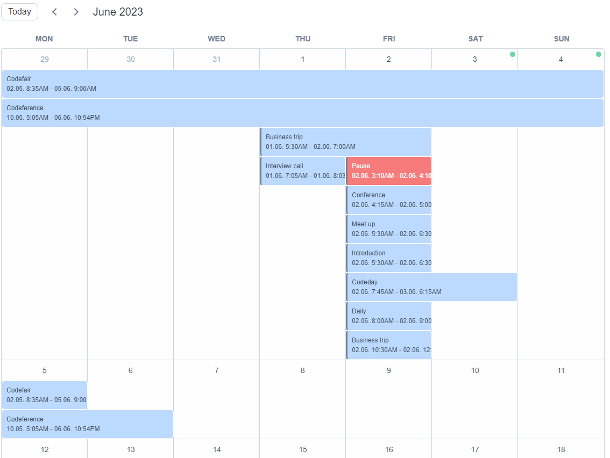
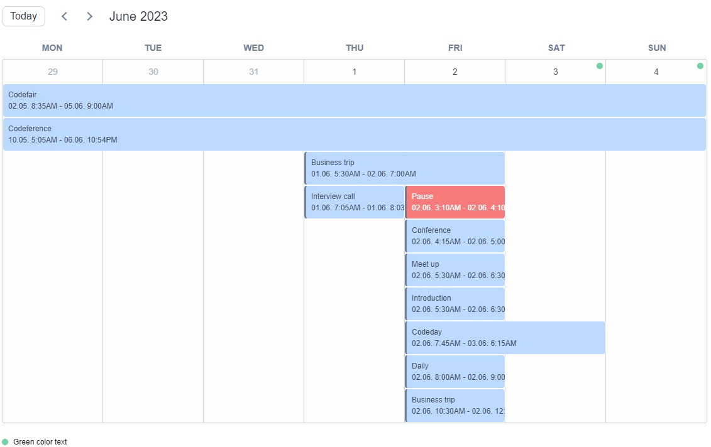
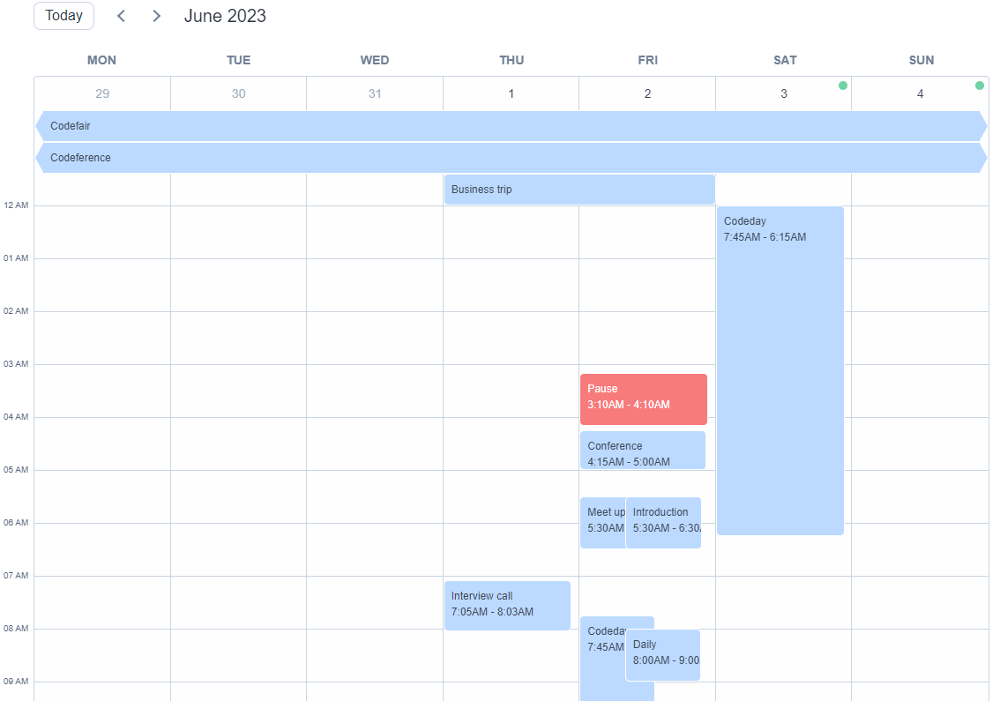
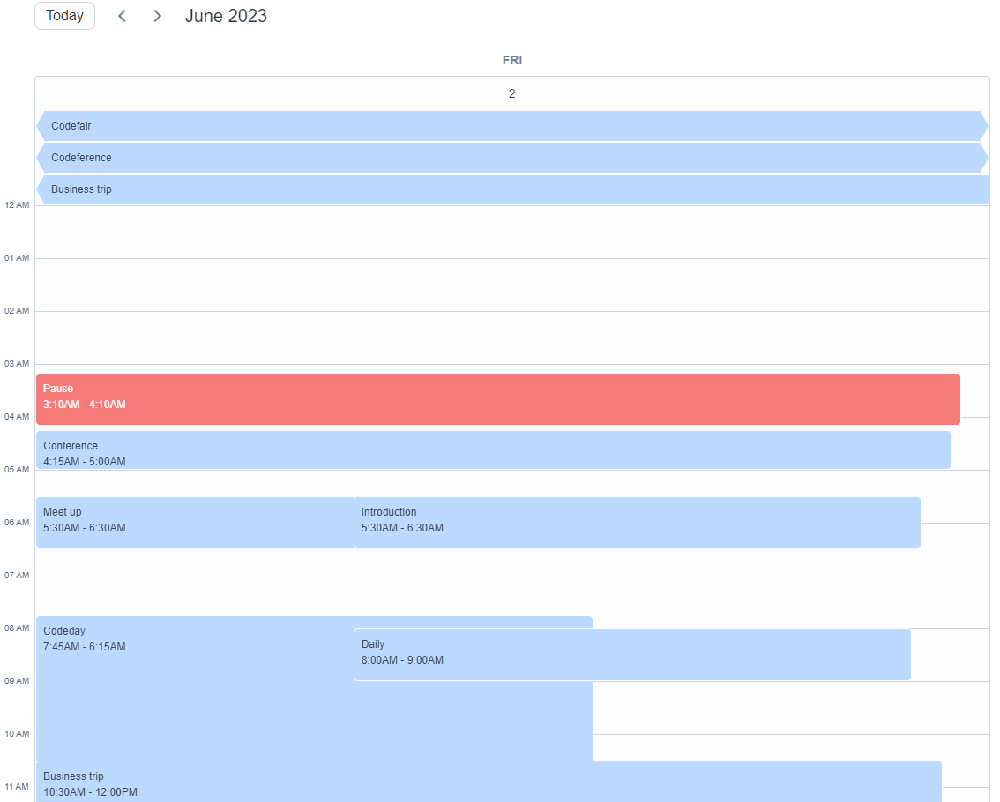
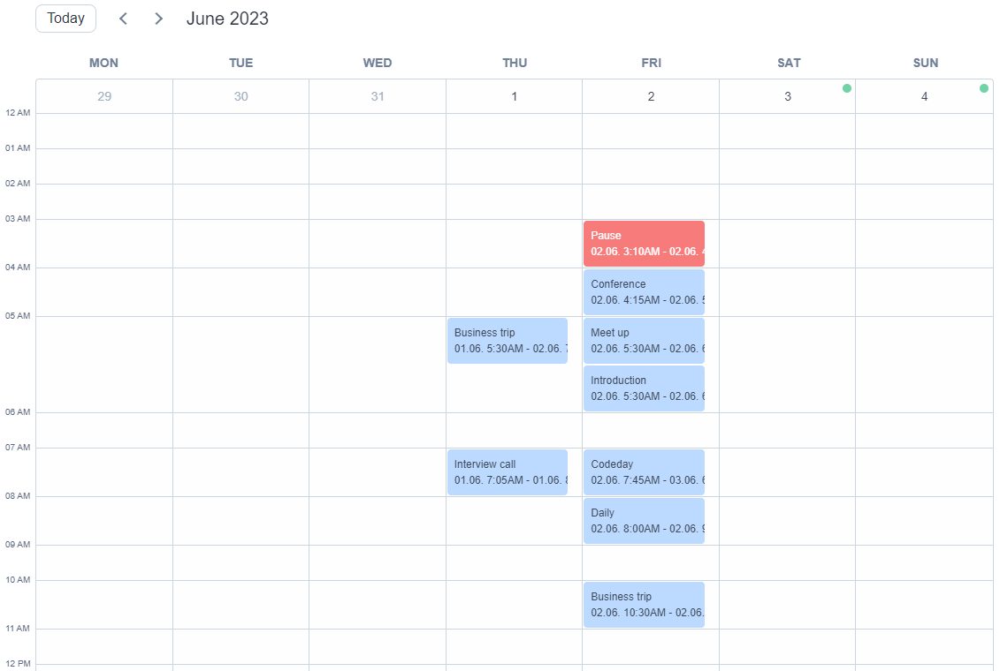
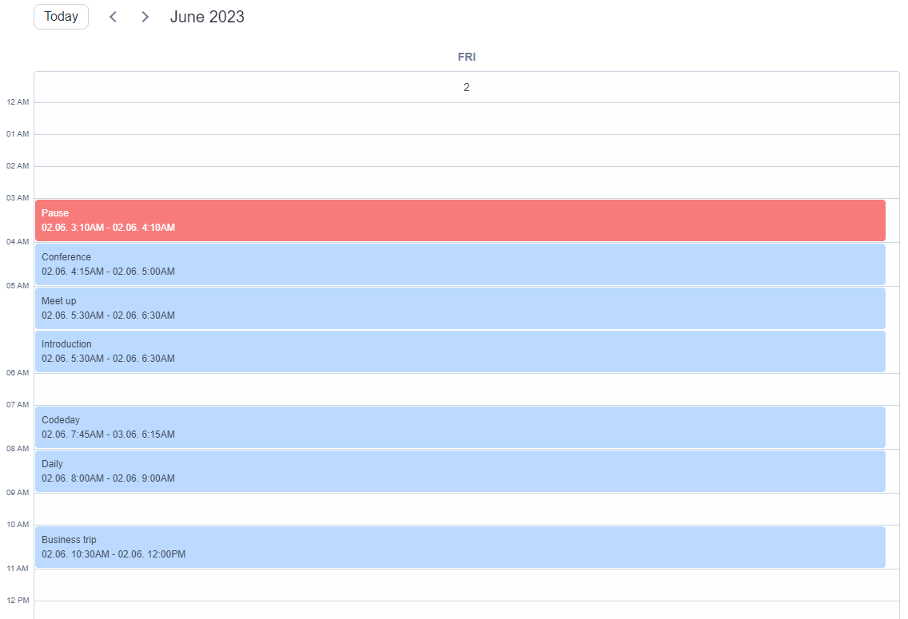

import { Callout } from 'nextra/components'
import Meta from '../components/Meta.jsx';

export default function wrapper({ children }) {
  return (
    <>
      <Meta
        description="Explore the different views available in react-lightweight-calendar. Learn how to customize and switch between calendar views in your React applications for a tailored user experience."
        keywords="react calendar views, react calendar component views, calendar view options react, customize calendar views react, react-lightweight-calendar views"
        title="Explore Different Views in React-Lightweight-Calendar"
        canonical="https://calendar-react.com/views"
      />
      

        {children}
      

    </>
  );
}

<wrapper>
  ## Calendar Views 

  The React Lightweight Calendar is a powerful calendar visualization tool that provides a versatile set of views to
  cater to all your scheduling needs. With a user-friendly and customizable design, this component offers a seamless 
  experience for managing events, appointments, schedules... Whether you're planning for a month, a week, or a single
  day, the React Lightweight Calendar has you covered.

   
  <Callout type="info" emoji="ℹ️">
    There are currently 6 calendar views developed. It is planned to develop 3 additional views.
  </Callout>
   

  ### 1. Month View (MONTH)
  The Month View presents a comprehensive monthly display of events and schedules. Users can effortlessly visualize their events, appointments, and activities organized by days within a specific month. Offering a bird's-eye view of the entire month, this layout allows users to quickly identify busy periods and important dates at a glance.
  

  ### 2. Week View (WEEK)
  The Week View provides a focused representation of events and schedules for each week. Users can easily navigate through different weeks to view and manage their appointments and events occurring within specific periods. This view is particularly beneficial for those who prefer to plan and organize their tasks on a weekly basis, streamlining their workflow.
  

  ### 3. Week with Hours View (WEEK_TIME)
  The Week with Hours View is an special version of the Week View, integrating hours into the display. Users can now see events and activities scheduled for each day, broken down into hourly or specific time intervals. This time-sensitive layout is ideal for scenarios where precise timing and scheduling are crucial for successful planning and coordination.
  

  ### 4. Day View with Hours (DAY)
  The Day View focuses on presenting events and schedules for a single day in detail. Users can see all the events scheduled for a specific date, making it effortless to manage daily appointments and activities. This view is especially valuable for users who prefer organizing their tasks on a day-to-day basis, ensuring that nothing gets overlooked.
  

  ### 5. Week in Place View (WEEK_IN_PLACE)
  The Week in Place View offers an alternative representation of events and schedules for the entire week.
  Instead of displaying events through days and hours, this view presents all events for the week in a specific hour.
  It provides a unique perspective, allowing users to grasp the week's engagements which are grouped in a specific hour.
  This display is used more as a diagram of the appearance of an entity by hours.
  

  ### 6. Day in Place View (DAY_IN_PLACE)
  The Day in Place View offers an alternative representation of events and schedules for the specific day.
  Instead of displaying events through hours, this view presents all events for the day in a specific hour.
  It provides a unique perspective, allowing users to grasp the day's engagements which are grouped in a specific hour.
  This display is used more as a diagram of the appearance of an entity by hours.
  
</wrapper>